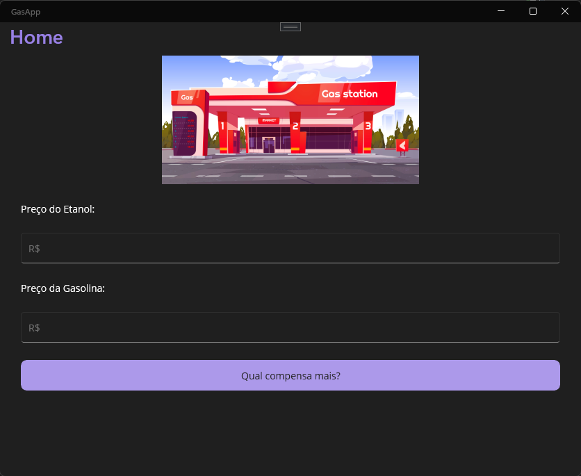
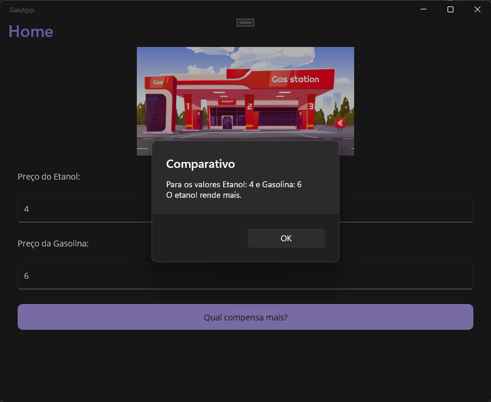

# GasApp

  

  
  

Aplicação .NET MAUI para comparação entre rendimento de combustíveis (etanol e gasolina) em veículos. A regra utilizada para gerar a indicação segue a ideia de que o etanol deve corresponder ao preço de no máximo 70% do valor por litro de gasolina. 

## Licença

Distribuído sob licença MIT.
   

## Autor

Desenvolvido por Fernando Gonzaga:

  - Linkedln: https://www.linkedin.com/in/fernando-gonzaga21/
  - GitHub: https://github.com/fernandoGonzaga0
